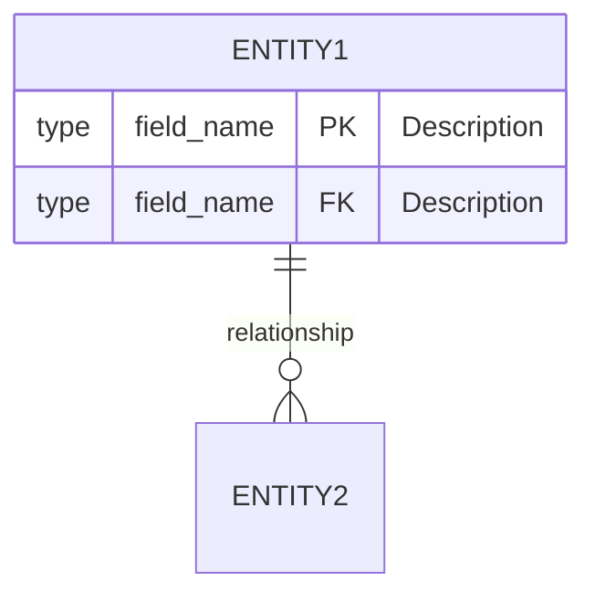
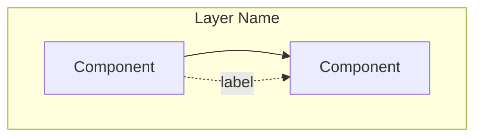
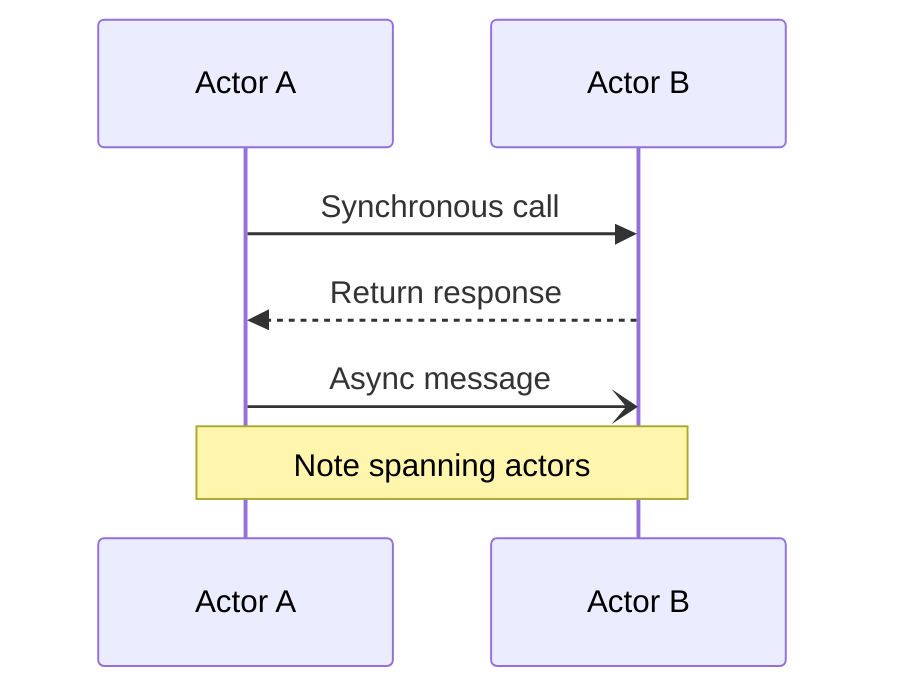

# Architecture Diagrams

This directory contains Mermaid diagrams documenting MediaStream's architecture, data relationships, and key flows.

## Overview

All diagrams use [Mermaid](https://mermaid.js.org/) format, which is:
- **Text-based** - Easy to version control and diff
- **Rendered natively** - GitHub, GitLab, many IDEs support Mermaid
- **Maintainable** - Update diagrams by editing text
- **Exportable** - Can generate PNG/SVG with Mermaid CLI

## Diagrams

### [data_relationships.mmd](data_relationships.mmd)

**Type**: Entity-Relationship Diagram

**Shows**: Database schema relationships

**Entities**:
- `AUDIO_FILES` - Core media library
- `PLAYBACK_STATES` - Per-device playback state
- `LISTENING_HISTORY` - Listening session tracking

**Relationships**:
- AudioFiles → PlaybackStates (1:N via `current_file_id`, ON DELETE NILIFY)
- AudioFiles → ListeningHistory (1:N via `audio_file_id`, ON DELETE CASCADE)

**Use When**:
- Understanding database structure
- Planning schema changes
- Documenting foreign key relationships

### [system_architecture.mmd](system_architecture.mmd)

**Type**: Component Diagram

**Shows**: System architecture and component interactions

**Components**:
- **Client Layer**: Browser UI, HTML5 Audio Element, JS Hooks
- **Web Layer**: Router, LiveViews, Controllers
- **Business Logic**: Media Context
- **Infrastructure**: PubSub, Ecto Repo
- **Storage**: SQLite Database, Filesystem

**Data Flows**:
- WebSocket LiveView connections (bidirectional)
- HTTP range requests for audio streaming
- Database queries via Repo
- PubSub broadcasts for real-time sync

**Use When**:
- Onboarding new developers
- Planning architectural changes
- Understanding system boundaries

### [pubsub_flow.mmd](pubsub_flow.mmd)

**Type**: Sequence Diagram

**Shows**: Real-time synchronization flow across browser tabs

**Participants**:
- Browser Tab 1
- Browser Tab 2
- PlayerLive instances
- Media Context
- Phoenix PubSub
- SQLite Database

**Flow Steps**:
1. Device ID generation and session setup
2. PubSub subscription to device-specific topic
3. State restoration from database
4. User action in Tab 1 (play)
5. Database update
6. PubSub broadcast
7. Tab 2 receives update and syncs UI

**Use When**:
- Understanding multi-tab sync
- Debugging sync issues
- Planning real-time features

### [streaming_sequence.mmd](streaming_sequence.mmd)

**Type**: Sequence Diagram

**Shows**: HTTP range request handling for audio streaming

**Participants**:
- Browser Audio Element
- AudioController
- Filesystem
- Database

**Scenarios Covered**:
1. **Full file request** (no Range header) → 200 OK
2. **Byte range request** (`bytes=START-END`) → 206 Partial Content
3. **From byte to end** (`bytes=START-`) → 206
4. **Last N bytes** (`bytes=-N`) → 206
5. **File not found** → 404 Not Found

**Use When**:
- Understanding audio seeking implementation
- Debugging playback issues
- Planning streaming optimizations

## Viewing Diagrams

### GitHub

Mermaid diagrams render automatically in GitHub:
- View .mmd files directly in repository
- Renders in README.md files
- Works in issues and pull requests

### VS Code

Install Mermaid extension:
```bash
code --install-extension bierner.markdown-mermaid
```

Preview .mmd files with markdown preview.

### Command Line

Install Mermaid CLI:
```bash
npm install -g @mermaid-js/mermaid-cli
```

Generate images:
```bash
# PNG
mmdc -i data_relationships.mmd -o data_relationships.png

# SVG
mmdc -i system_architecture.mmd -o system_architecture.svg

# PDF
mmdc -i pubsub_flow.mmd -o pubsub_flow.pdf
```

### Online Editor

Use [Mermaid Live Editor](https://mermaid.live/):
1. Copy .mmd file contents
2. Paste into editor
3. View rendered diagram
4. Export as PNG/SVG

## Editing Diagrams

### Entity-Relationship Diagrams



**Relationship Symbols**:
- `||--||` : One-to-one
- `||--o{` : One-to-many
- `}o--o{` : Many-to-many

**Field Markers**:
- `PK` : Primary key
- `FK` : Foreign key
- `UK` : Unique key

### Component Diagrams



**Arrow Types**:
- `-->` : Solid (strong dependency)
- `-.->` : Dotted (weak/async dependency)
- `==>` : Thick (data flow)

### Sequence Diagrams



**Arrow Types**:
- `->>` : Synchronous call
- `-->>` : Return/response
- `-)` : Async message
- `-x` : Lost message

## Keeping Diagrams Updated

### When to Update

Update diagrams when:
- Adding/removing database tables or columns
- Changing foreign key relationships
- Adding new system components
- Modifying communication patterns
- Changing real-time flows

### Update Checklist

When modifying architecture:
1. ✅ Update relevant .mmd file
2. ✅ Update corresponding data/action models
3. ✅ Update feature documentation
4. ✅ Verify diagram renders correctly
5. ✅ Update this README if needed

### Diagram Conventions

**Naming**:
- Use lowercase with underscores: `data_relationships.mmd`
- Be descriptive: `pubsub_flow.mmd` not `flow.mmd`

**Style**:
- Consistent indentation (2 spaces)
- Clear component names
- Descriptive relationship labels
- Include notes for complex flows

**Content**:
- Focus on "what" not "how"
- Show key components, not every detail
- Use notes to clarify complex interactions
- Keep diagrams at consistent abstraction level

## Exporting for Documentation

Generate all diagrams as images:

```bash
# Create output directory
mkdir -p exports

# Export all diagrams as PNG
for file in *.mmd; do
  mmdc -i "$file" -o "exports/${file%.mmd}.png"
done

# Export all diagrams as SVG
for file in *.mmd; do
  mmdc -i "$file" -o "exports/${file%.mmd}.svg"
done
```

Include in external documentation:
```markdown

```

## Related Documentation

- **Data Models**: [../data_models/](../data_models/)
- **Action Models**: [../action_models/](../action_models/)
- **Features**: [../features/](../features/)
- **Mermaid Docs**: https://mermaid.js.org/
